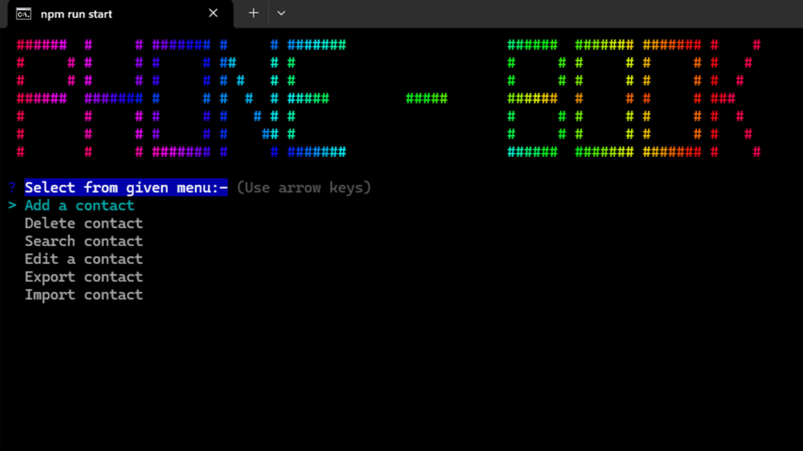

# PHONE-BOOK app


<!-- markdownlint-disable MD033 -->
<h1 style="color:teal; font-weight:700; font-variant:small-caps; font-family:arial;">
  Run following commands
</h1>
<!-- markdownlint-enable MD033 -->

## COMMANDS FOR INITIALIZING THE APP

```bash
  mkdir exports
  mkdir imports
  npm install
  npx drizzle-kit generate
  npx drizzle-kit migrate
  npm run build
  npm run start
```

.png> "app starting page")
.png> "delete contact")
.png> "delete contact")
.png> "importing contact")
.png> "contact page")
.png> "contact page")
.png> "searching page")
.png> "search filter page")
.png> "search with unique id")
